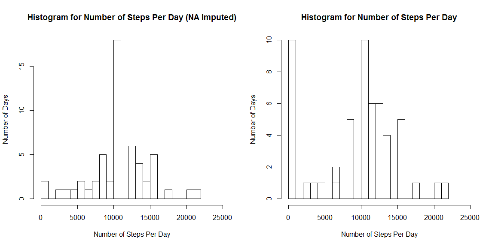
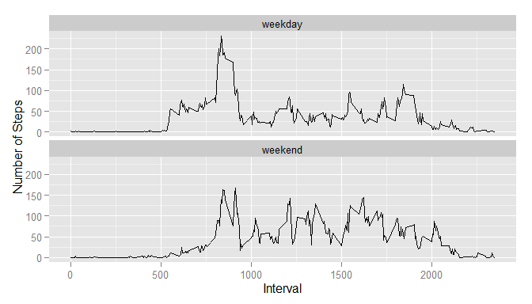

# Reproducible Research: Peer Assessment 1

## Loading and preprocessing the data

```r
    library(data.table)
    activity <- fread("activity.csv", sep=",", header="auto", na.strings="NA")
```

## What is mean total number of steps taken per day?
### 1.Calculate the total number of steps taken per day

```r
	steps_by_date = activity[,list(steps=sum(steps, na.rm=TRUE)),by=date]
```

### 2.Make a histogram of the total number of steps taken each day

```r
    hist(steps_by_date$steps,breaks=25,xlab="Number of Steps Per Day",ylab="Number of Days", main="Histogram for Number of Steps Per Day",xlim=c(0,25000))
```

 

### 3.Calculate and report the mean and median of the total number of steps taken per day

```r
	mean(steps_by_date$steps)	
```

```
## [1] 9354.23
```

```r
	median(steps_by_date$steps)	
```

```
## [1] 10395
```

## What is the average daily activity pattern?
### 1.Make a time series plot (i.e. type = "l") of the 5-minute interval (x-axis) and the average number of steps taken, averaged across all days (y-axis)

```r
	steps_by_interval = activity[,list(steps=mean(steps, na.rm=TRUE)),by=interval]
	plot(steps_by_interval$interval, steps_by_interval$steps,type="l",xlab="5-minute Interval (hhmm)",ylab="Average No. of Steps/5-min Interval",main="Time Series of Average Daily Activity",xaxp=c(0,2400,24))
```

 

### 2.Which 5-minute interval, on average across all the days in the dataset, contains the maximum number of steps?

```r
	steps_by_interval[ which(steps==max(steps)),]
```

```
##    interval    steps
## 1:      835 206.1698
```

## Imputing missing values
### 1.Calculate and report the total number of missing values in the dataset (i.e. the total number of rows with NAs)

```r
	no_activity <- subset(activity, is.na(activity$steps))
	nrow(no_activity)	
```

```
## [1] 2304
```
### 2.Devise a strategy for filling in all of the missing values in the dataset. 
#### The strategy I take is to use the mean for that 5-minute interval.

```r
fill_na = function(intv, steps) {
    if(is.na(steps))
        steps_by_interval[ which(interval==intv),steps]
    else
        steps
}
```
### 3.Create a new dataset that is equal to the original dataset but with the missing data filled in.

```r
	activity3 = activity[, steps_filled:=mapply(fill_na, interval, steps)]
```
### 4.1 Make a histogram of the total number of steps taken each day. 

```r
    steps_by_date3 = activity3[,list(steps=sum(steps_filled)),by=date]
	par(mfrow=c(1,2))
	hist(steps_by_date3$steps,breaks=25,
	     xlab="Number of Steps Per Day",ylab="Number of Days", 
	     main="Histogram for Number of Steps Per Day (NA Imputed)",xlim=c(0,25000))
	hist(steps_by_date$steps,breaks=25,
	     xlab="Number of Steps Per Day",ylab="Number of Days", 
	     main="Histogram for Number of Steps Per Day",xlim=c(0,25000))
```

 

### 4.2 Calculate and report the mean and median total number of steps taken per day

```r
	mean(steps_by_date3$steps)	
```

```
## [1] 10766.19
```

```r
	median(steps_by_date3$steps)
```

```
## [1] 10766.19
```
### 4.3 Do these values differ from the estimates from the first part of the assignment? What is the impact of imputing missing data on the estimates of the total daily number of steps?
- Yes, both values are increased; the mean is increased by 1411.96 and the median is increased by 371.19.
- In original data, there are 8 days without any steps. The process of imputing missing data adds steps to them and moves those 8 days to the max height column at the center of the histogram. 

## Are there differences in activity patterns between weekdays and weekends?
### Use the dataset with the filled-in missing values for this part.
### 1.Create a new factor variable in the dataset with two levels - "weekday" and "weekend" indicating whether a given date is a weekday or weekend day.

```r
weekend_factor = function(date) {
    if(weekdays(as.Date(date)) %in% c("Saturday", "Sunday"))
        "weekend"
    else
        "weekday"
}
activity3 = activity3[, weekDayorEnd:=sapply(date, weekend_factor)]
activity3$weekDayorEnd <- as.factor(activity3$weekDayorEnd)
```
### 2.Make a panel plot containing a time series plot (i.e. type = "l") of the 5-minute interval (x-axis) and the average number of steps taken, averaged across all weekday days or weekend days (y-axis). 

```r
    avg_steps_weekdayOrEnd <- aggregate(steps_filled~interval+weekDayorEnd, data=activity3, mean)
    library(ggplot2)
	qplot(interval,steps_filled,data=avg_steps_weekdayOrEnd,geom = "line",xlab="Interval",ylab="Number of Steps")+facet_wrap(~weekDayorEnd, ncol=1)
```

 
